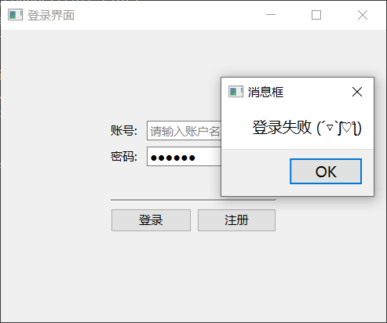
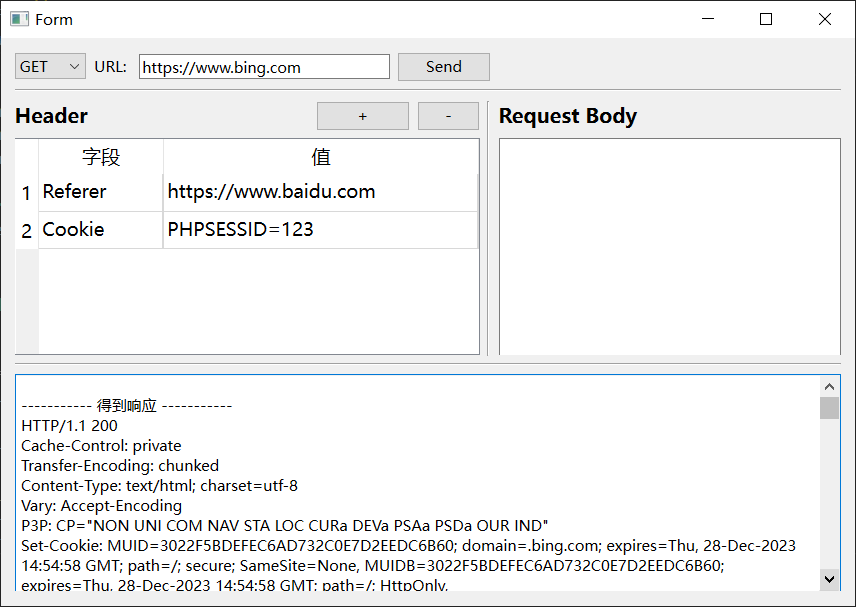
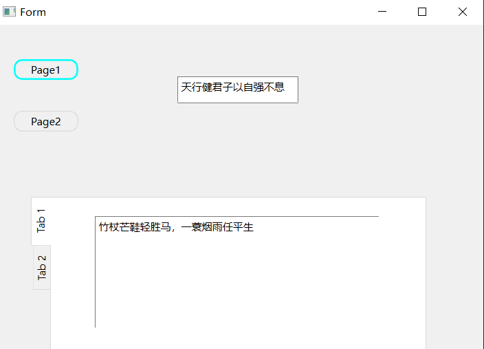
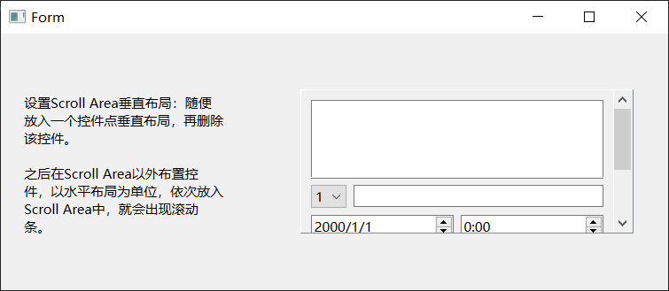

> 记录下qt学习吧，总是喜欢折腾，什么时候能分清主次呢，加油吧

## 1.登录页面
- 知识点
    - 通过Qtdesigner设计好登录页面，加载ui文件，用到 PySide6.QtUiTools.QUiLoader().load() 函数
    - 添加占位显示文字 ；setPlaceholderText()
    - 输入密码显示为 * ；setEchoMode(QLineEdit.Password)
- 不完善的地方 How?
    - 输入字符的严格限制，比如仅允许输入字母数字
    - 和数据库的联合，验证密码，现在只是前端的一个小玩意
    - 这个QSS有时间再说吧，现在不想搞

## 2.http接口测试
- 通过 requests 库处理请求
- QTableWidget 类的方法使用removeRow、insertRow、currentRow

## 3.多个窗口切换
- 主要是方法的调用: QWidgets.hide() / close() / show()

## 4.一个窗口下多个标签页
- 方法一: QStackedWidget 
    - 绑定槽函数，实现界面的切换
- 方法二: QTabWidget
    - 默认Tab是在顶部的，我的需求是在左侧即West
    - 文字方向的调整
- lambda表达式 
- 样式设计setStyleSheet

## 5.滚动条的添加
目前能够知道的是有两种方法：
1. QScrollArea类
2. QScrollBar类, 和QWidget合作，将QScrollBar拖动时的数值通过换算来移动QWidget同样的距离

